# PROJECT_WORKBENCH

**A single-operator workbench that turns a plain-language app idea into a certified, build-ready specification package for AI coding agents** (Claude Code, Codex, Cursor, Lovable, Replit and compatible tools).

I built this solo with AI coding agents, August to September 2026, in Next.js / TypeScript. The source is private; this repo is a case study with screenshots and a complete sample output. I'm happy to walk through the code live.

**Live showcase:** https://jerry-builds.github.io/project-workbench-case-study/

<a href="assets/infographic.png">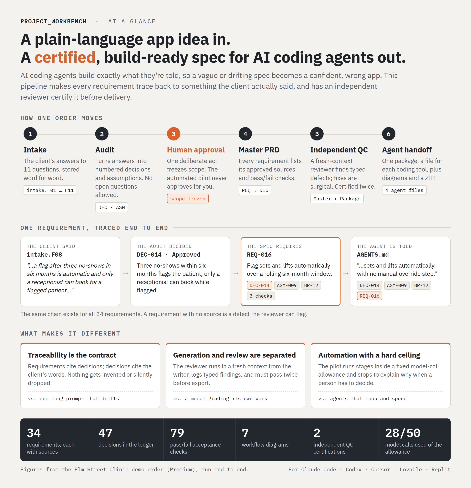</a>

---

## The problem

AI coding agents build what they are told. A vague idea produces a confident, wrong app. And one long generated spec written in one pass drifts: it invents requirements, drops ones the client stated, and contradicts itself. A human reviewer then has to catch all of that by hand.

I wanted a pipeline where **every requirement traces back to something the client actually said**, and where an independent reviewer has to certify the spec before anything is delivered.

## What it does

In my pipeline, one order moves through a fixed sequence of stages. Each stage is a separate model call with its own structured output, validated on the server.

| Stage&nbsp;and&nbsp;screen&nbsp;(click&nbsp;to&nbsp;enlarge) | What happens |
|---|---|
| **Intake** <a href="screenshots/intake.png">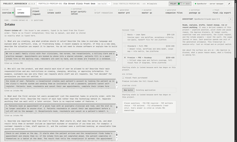</a> | The client's answers to an 11-question form, stored verbatim. Every answer is cited downstream as `intake.F01` to `intake.F11`. |
| **Intake audit** <a href="screenshots/intake_audit.png">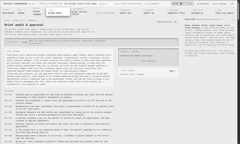</a> | Reads the answers and produces numbered **decisions**, assumptions, resolutions and open questions. It rechecks earlier resolutions for mutual consistency and catches client-stated facts that were missed. |
| **Brief certification** <a href="screenshots/brief_certification.png">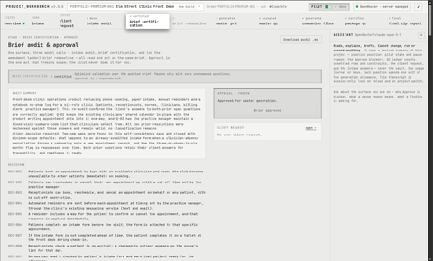</a> | An optimized validation pass. It passes only with **zero unanswered questions**. |
| **Approval (human)** *Approval panel on the Brief certification screen* | The one act that **freezes scope**. The automated pilot can pause for approval, but it never approves for you. |
| **Brief rebaseline (only when needed)** <a href="screenshots/brief_rebaseline.png">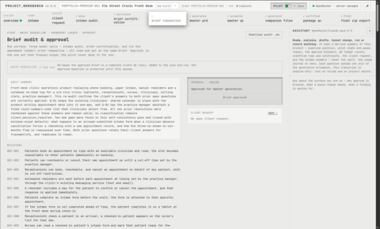</a> | Re-bases the approved brief on a complete client QC reply. It is added to the plan mid-run, and the approved baseline is kept until the rebaseline passes. Not needed for this order. |
| **Master PRD** <a href="screenshots/master_prd.png">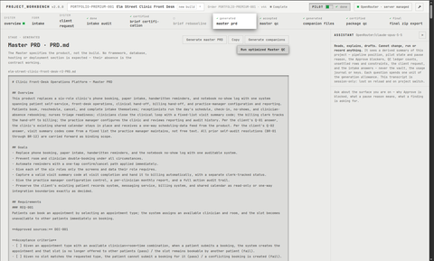</a> | One product spec. Every requirement (`REQ-001`...) lists its **approved sources** (`DEC-001, ASM-004`), acceptance criteria and milestone. It specifies the product, not the build. |
| **Master QC** <a href="screenshots/master_qc.png">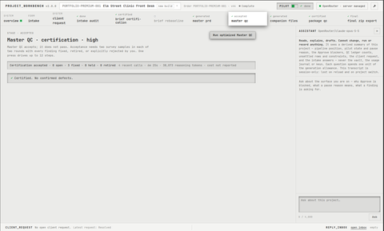</a> | An independent reviewer in a fresh context. It emits typed findings, the system repairs them surgically, and it rechecks. Acceptance needs two clean survey samples in each of two rounds, with every finding fixed, retired, or explicitly rejected by the operator. |
| **Companion files** <a href="screenshots/companion_files.png">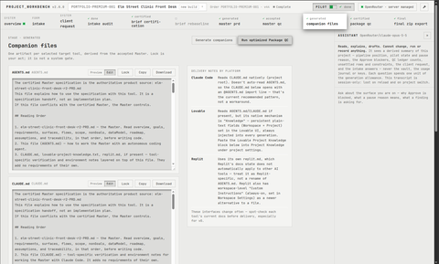</a> | One handoff file per target tool, derived from the accepted Master: `AGENTS.md` (Codex, Cursor and compatible agents), `CLAUDE.md` (Claude Code, importing AGENTS.md), `replit.md`, and Lovable Project Knowledge. |
| **Package QC** <a href="screenshots/package_qc.png">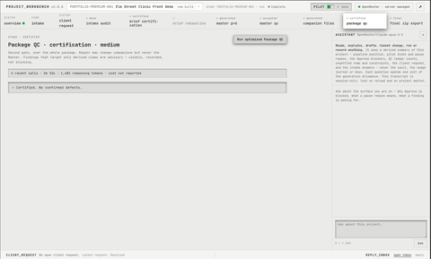</a> | A second certification over the whole package. |
| **Final ZIP export** <a href="screenshots/final_zip_export.png">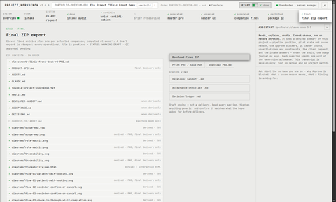</a> | Master PRD, product spec, companion files, developer handoff, acceptance checklist, decision ledger, the diagram pack (scope map, role matrix, traceability diagram, an interactive traceability map, and one flowchart per core workflow, in SVG and PNG), changelog, delivery message and a manifest. A draft export is stamped so it can't be mistaken for final. |

**Supporting screens**

| Screen&nbsp;(click&nbsp;to&nbsp;enlarge) | What it shows |
|---|---|
| <a href="screenshots/overview.png">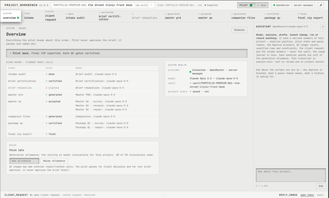</a> **Overview** | The stage board with the planned model calls, pilot status and the generation allowance. |
| <a href="screenshots/client_request.png">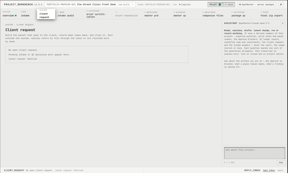</a> **Client request** | Builds the packet that goes to the client when an answer or QC decision needs them, records what comes back, and closes it. |
| <a href="screenshots/inbox.png">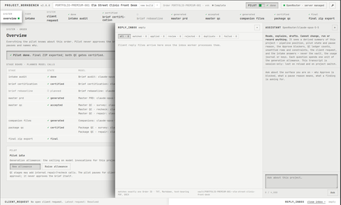</a> **Reply inbox** | Client replies arrive as files and are matched to exactly one order, then applied, flagged for review, or rejected. |

*Click any thumbnail for the full-size screenshot.*

## Design choices worth talking about

- **Freeze, then generate.** Scope is frozen by an explicit human approval. Everything downstream generates against that frozen brief, and a change goes through a rebaseline stage instead of silent edits.
- **Traceability as a contract.** Requirements cite decisions and assumptions; decisions cite intake answers. A requirement with no source is a defect the QC reviewer can find.
- **Independent review, typed findings.** QC runs in a fresh context from the generator. Findings are typed and ledgered; repairs are surgical rather than full regenerations.
- **A pilot that can't overstep.** An automated pilot drives stages within a **generation allowance** (a hard ceiling on model calls per project; the sample order used 28 of 50). It pauses and names why for client decisions and approvals.
- **A read-only assistant.** The side-panel assistant can explain any stage ("why is Approve blocked?") from a derived summary. It cannot change, run or record anything, and it never sees keys or the vault.
- **Durable state, no database.** Server-owned versioned project JSON, a per-project operation ledger, and a usage journal with one line per model dispatch. It records tokens rather than dollars, so cost is priced at read time from a dated rate table.
- **Provider-agnostic.** OpenRouter plus an OpenAI-compatible local proxy, with model routing per stage.

## What I measured

**Size (2026-09-24, `git ls-files` + `wc -l`, all lines):** ~74,000 lines of TypeScript in `app/` and `lib/`, and ~78,500 lines of tests across 165 test files (vitest unit/integration and Playwright end-to-end). 774 commits over about five weeks.

**Three demonstration orders, one per package, run end to end on the system's own pipeline (2026-09-18/19, baseline run on claude-sonnet-5):**

|  | Basic | Standard | Premium |
|---|---:|---:|---:|
| Subject | Dog walker's slot sheet | Community theatre box office | Clinic front desk |
| Provider calls | 21 | 21 | 36 |
| of which format repairs | 4 | 4 | 8 |
| Provider time | 42 min | 42 min | 70 min |
| Master: requirements / flows / screens | 15 / 6 / 5 | 35 / 7 / 6 | 34 / 8 / 7 |
| Estimated calls on a clean rerun | ~14 | ~17 | ~20 |

I traced every inflated number to a named cause and fixed each one in the pipeline rather than working around it:

- **Basic:** the pilot had no repair step after Package QC, so it looped on re-certification. It now plans the repair.
- **Standard:** a reconciliation bug dropped the closure record of a client conflict, so the pause could never clear. Fixed.
- **Premium:** the audit hit its output ceiling. The ceiling was raised.

**Cost (measured 2026-09-05 from two archived orders, at list API rates):** about **$1.86 per completed order on Sonnet-class models**. One early order that never converged cost $11.87. **What I learned:** the cost driver was **QC convergence, not model choice**. I fixed it by changing the acceptance rules and repair strategy, not by switching to a cheaper model.

## Sample output: Elm Street Clinic Front Desk (Premium)

The screenshots and [`sample/`](sample/) come from a Premium order I invented and ran end to end. A six-role family clinic (patients, receptionists, nurses, clinicians, billing clerk, practice manager) wants to replace phone booking into a shared calendar, paper intake forms, hand-sent reminders and a no-show notebook. The certified Master covers self-booking, reminders with confirm/cancel, check-in through visit completion, no-show handling, clinician-absence rebooking, and a one-way feed to the clinic's existing calendar.

`sample/` is the exact final package the pipeline exported:

- [the Master PRD](sample/elm-street-clinic-front-desk-r2-PRD.md);
- [the decision ledger](sample/DECISIONS.md) and [acceptance checklist](sample/ACCEPTANCE.md);
- the companion files for [Claude Code](sample/CLAUDE.md), [Codex/Cursor](sample/AGENTS.md), [Lovable](sample/lovable-project-knowledge.txt) and [Replit](sample/replit.md);
- [seven workflow flowcharts, scope map, role matrix and traceability diagram](sample/diagrams/);
- an interactive traceability map (`sample/diagrams/traceability-map.html`; download and open it in a browser).

I wrote this demonstration order myself; it is not client work.

## Tools used to build it

I built it with Claude Code, Codex, Cursor and other agentic coding tools, using a spec, then plan, then implementation workflow. The same agents are the audience for the package it produces, so I built and tested it against how they actually read `AGENTS.md` and `CLAUDE.md`.

## Contact

[LinkedIn](https://www.linkedin.com/in/jerry-rivas) · [GitHub](https://github.com/jerry-builds)
